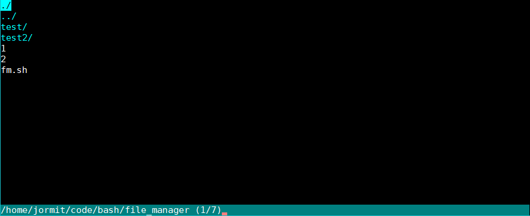

## terminal-fm
This is a simple file manager written in bash that looks nice and is easy to use. At the moment it only supports changing directories and printing out files but there is more to come.

## todo
- Add support for different filetypes.
- Improve performance.
- Support listing directories larger than screen.
- scripting??
- color schemes.

